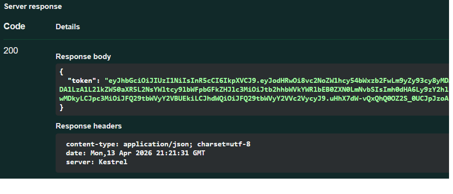
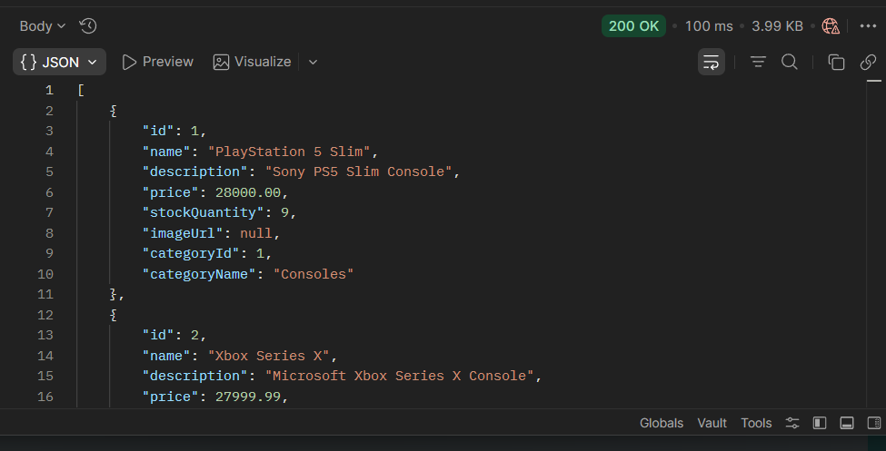
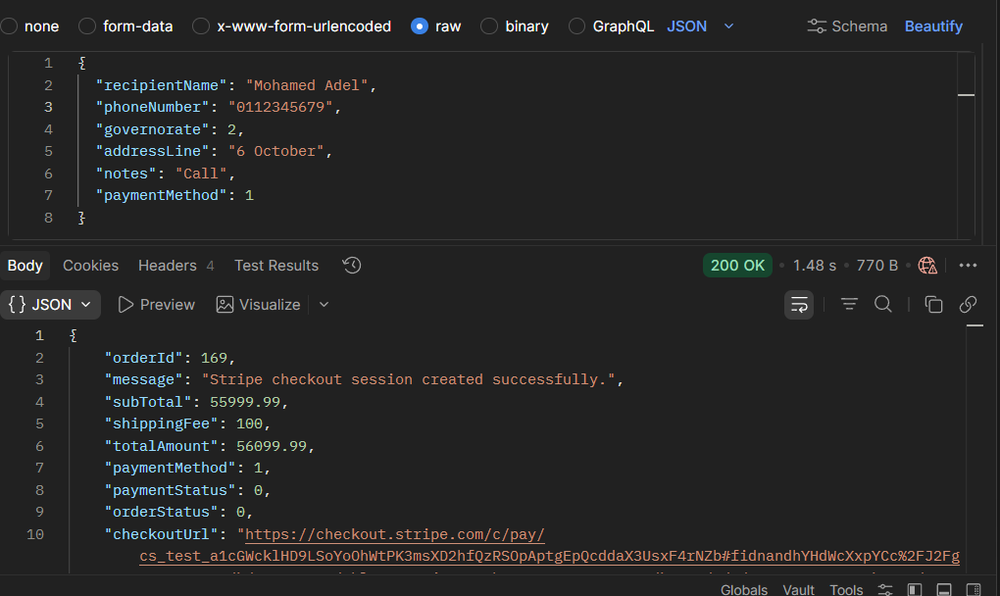
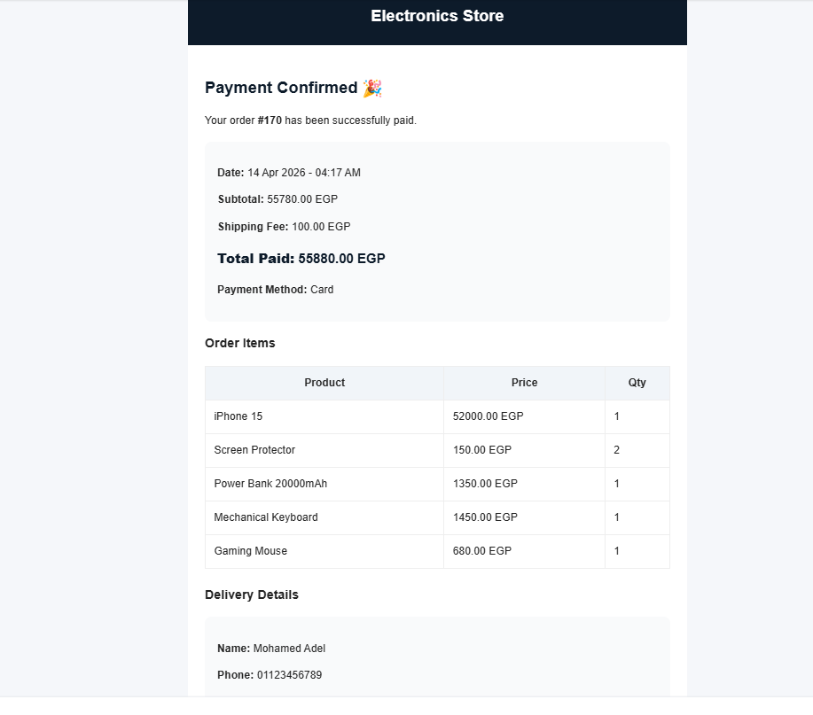

# 🛒 E-Commerce Backend API (.NET)

A production-ready E-commerce backend system built using ASP.NET Core, following clean architecture principles and real-world backend design patterns.

---

## 📌 Overview

This project simulates a real-world e-commerce backend system with advanced features beyond basic CRUD operations.

It includes authentication, product management, cart handling, order processing, payment integration, and email notifications.

The system is designed with scalability and maintainability in mind, using modern backend architecture patterns such as Repository Pattern and Unit of Work.

---

## 🚀 Features

### 🔐 Authentication & User Management
- JWT Authentication (Register / Login)
- Update Profile (PATCH)
- Change Password
- Change Email

### 🛍 Product Management
- Product & Category CRUD
- Partial Updates (PATCH: price, stock)

### 🛒 Shopping Cart
- Add / Remove Items
- Update Item Quantity

### 📦 Orders
- Create Orders
- Order Status Management (Pending → Completed / Cancelled)

### 💳 Payments
- Stripe Checkout Integration
- Webhook Handling for Payment Confirmation

### 📧 Notifications
- Email Confirmation using Resend API

### 🎯 Recommendations
- Recommendation system based on user behavior

---

## 🧠 Architecture

The project follows a clean layered architecture:

- Controllers → Handle HTTP requests
- Services → Business logic layer
- Repositories → Data access layer
- Unit of Work → Manages transactions across repositories
- DTOs → Data transfer objects
- Entity Framework Core → ORM

### 🔥 Key Design Patterns

- Repository Pattern
- Unit of Work Pattern
- Dependency Injection
- Separation of Concerns

---

## 🛠 Tech Stack

- ASP.NET Core Web API
- Entity Framework Core
- SQL Server
- Stripe API
- Resend Email API

---

## 📸 API Preview

### 🔐 Authentication


### 🛍 Products


### 💳 Checkout


### 📧 Payment Confirmation Email


---

## ▶️ How to Run

1. Clone the repository  
2. Update appsettings.json (add your keys)
3. Apply migrations:
```bash
dotnet ef database update
```
5. Run the project:
```bash
dotnet run
```

---

##📌 Future Improvements
- AI-powered recommendation system 🤖
- Frontend integration
- Email verification (OTP)

---

##🤝 Contribution
- Feel free to fork or contribute!
